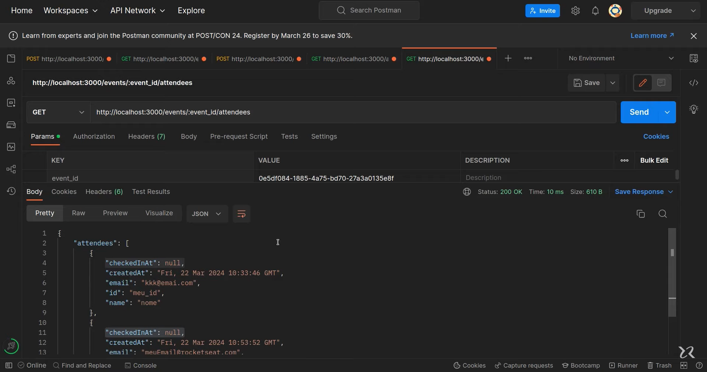
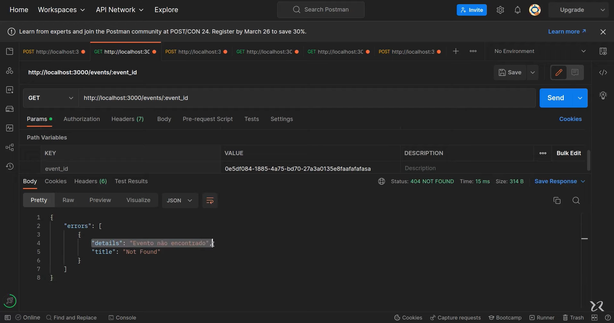

# Aplicação de Gerenciamento de Eventos e Participantes em Python



Esta aplicação de servidor em Python permite gerenciar eventos e participantes, incluindo a inscrição de participantes, check-in, busca de participantes por badge e visualização de detalhes dos participantes.

## Funcionalidades Principais

### 1. Inscrição de Participantes

- **Implementação**: A inscrição de participantes é realizada através de uma requisição POST para a rota `/events/<event_id>/register`. O corpo da requisição deve conter os dados do participante.
- **Detalhes**: A inscrição verifica se o evento não está lotado antes de adicionar o participante. Caso o evento esteja lotado, retorna um erro de conflito HTTP 409.

### 2. Check-in de Participantes

- **Implementação**: O check-in de participantes é realizado através de uma requisição POST para a rota `/attendees/<attendee_id>/check-in`.
- **Detalhes**: Registra o check-in do participante no evento.

### 3. Busca de Participante por Badge

- **Implementação**: A busca de participante por badge é realizada através de uma requisição GET para a rota `/attendees/<attendee_id>/badge`.
- **Detalhes**: Retorna os detalhes do badge do participante, incluindo nome, e-mail e título do evento. Caso o participante não seja encontrado, retorna um erro de não encontrado HTTP 404.

### 4. Visualização de Detalhes dos Participantes de um Evento

- **Implementação**: A visualização dos detalhes dos participantes de um evento é realizada através de uma requisição GET para a rota `/events/<event_id>/attendees`.
- **Detalhes**: Retorna uma lista de participantes do evento, incluindo ID, nome, e-mail, data de check-in e data de criação. Caso não haja participantes para o evento, retorna um erro de não encontrado HTTP 404.

## Como Usar

1. **Iniciar o Servidor**: Certifique-se de que o servidor da sua aplicação em Python está rodando. Se você seguiu as instruções de instalação e execução fornecidas anteriormente, o servidor deve estar rodando no endereço `http://localhost:5000`.

2. **Testar a Aplicação**: Para testar a aplicação, você pode usar o pytest. Primeiro, certifique-se de que você tem o pytest instalado. Se não, você pode instalá-lo com o comando:

```bash
pip install pytest
```

Para executar os testes, navegue até o diretório do projeto no terminal e execute:

```bash
pytest
```


3. **Testar a API com o Postman**: Para testar a API usando o Postman, siga os passos abaixo:

- **Inscrição de Participantes**: Crie uma nova requisição POST para `http://localhost:5000/events/<event_id>/register` com o corpo da requisição contendo os dados do participante.
- **Check-in de Participantes**: Crie uma nova requisição POST para `http://localhost:5000/attendees/<attendee_id>/check-in`.
- **Busca de Participante por Badge**: Crie uma nova requisição GET para `http://localhost:5000/attendees/<attendee_id>/badge`.
- **Visualização de Detalhes dos Participantes de um Evento**: Crie uma nova requisição GET para `http://localhost:5000/events/<event_id>/attendees`.

## Instalação e Execução

Para executar a aplicação, siga os passos abaixo:

1. **Instalar Dependências**: Certifique-se de ter o Python e o pip instalados. Em seguida, instale as dependências necessárias com o comando:

```bash
pip install -r requirements.txt
```

2. **Executar o Servidor**: Execute o servidor com o comando:

```bash
python app.py
```

O servidor estará rodando no endereço `http://localhost:5000`.

## Requisitos

- Python 3.8 ou superior
- Flask
- SQLAlchemy
- pytest

## Documentação da API

Para documentação da API, acesse o link: [https://nlw-unite-nodejs.onrender.com/docs](https://nlw-unite-nodejs.onrender.com/docs)

